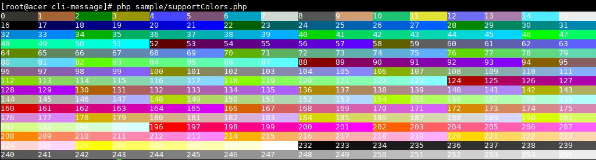

# Cli Message
Let your php output in command line colorful.

## Effect preview



## ask
- PHP >= 5.4

## usage method
### install
`composer require "guirong/cli-message"`

### Use example
```PHP
$style = new Style();
$style->setForegroundColor(Style::COLOR_GREEN) // Define the color as green
      ->setBold() // Set bold
      ->setUnderLine(); // Set display underline
$message = new Message();
$message->setStyle($style); // Style messages
$message->setContent('哈哈哈！'); // Set message content
echo $message, PHP_EOL; // Rewritten__ ToString method, the message object can be used directly as a string

// You can also use the getContentWithStyle method to obtain the processed string for output
echo $message->getContentWithStyle(), PHP_EOL;

$anotherStyle = new Style();
$anotherStyle->setForegroundColor(Style::COLOR_RED);
echo $message->getContentWithStyle($anotherStyle, PHP_EOL);
```
### Color description
- The color is controlled by an integer from 0 to 255. You can select the desired color by referring to the color table in the effect preview;

## agree on
This project uses MIT protocol.
